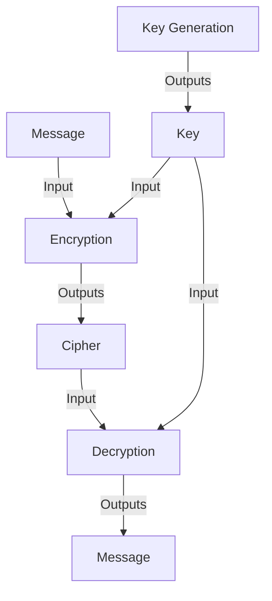

# Lecture 2 Hash and Symmetric Encryption

#### Hash
A Hash is the output of a mathematical algorithm that takes input data and converts it into a fixed size string (of characters). Note that even a the smallest change to an imput would output a very different hash. However, a hash is designed such that it is computationally infeasable to reverse the mathematical algorithm. 

In simpler terms, a hash is the output of a one way encryption process. However, while it is possible to 'reverse engineer' to get the original input, it is infeasible to do so because of the amount of resources needed. 

###### Example

An example of a Hash is as follows:

Given an input: `Hello, World!`

Using: `SHA-256 hash function`

Hash: `2ef7bde608ce5404e97d5f042f95f89f1c232871d1d6a35855afe7d1f1c1e7b2`

###### Usecase
Hashes are commonly used when authenticating passwords. This is because converting a password into a hash and having the server store the hash prevents passwords from being leaked. 

When attempting to log into the server, the inputted password would be converted into a hash, and the hash values would be compared. Thus, should there be a leak in data from the server side, the confidentiality of the passwords would still not be lost.

###### Collision Resistance
Collision resistance is a term used to describe the lack of discovering two inputs that would output the same value in a hash function. 

When two inputs are discovered to have the same output when using a specific hash function, it can be said that the specific hash function used is **not collision resistant**.

While having two inputs that have the same hash value in a hash function is still undiscovered. it can be said that the hash function **is collision resistant**.

#### Encryption

##### Prespective of the Attacker
From an attackers perspective, their goal is to do at least one of the following:
- Recover the whole plaintext
- Recover the key
- Recover some part of the plaintext
- Recover one particular part of plaintext
- Recover some part of the key
- Recover one particular part of key

##### Symmetric Encryption
Symmetric encryption is one of two common methods of encryption. This method requires 1 key to both encrypt and decrypt messages. This method is generally more effective for larger batches of data.

Note that each encryption is unique, making it near impossible to detect a pattern.

###### One-Time Pad
A one-time pad is a system that randomly generates a private key used only once to encrypt and decrypt a message. While using basic symmetric encryption makes it near impossible to detect a pattern in encryption, a one-time pad ensures a higher level of data safety. Note that the cipher produced from encryption contains both the message and the key.

Basically, its like the one time password (2 factor authentication) that is sent to confirm your identity when logging into a system.

###### Stream Cipher
A stream cipher is a form of symmetric encryption that uses an XOR operation. Simply put, it is an encryption that encrypts 'messages' one 'character' at a time. More professionally, it is a cipher the encrypts data one byte at a time. The most common form of this is through XOR (Exclusive Or, one or the other but not both).

Almost like a One-Time Pad, but slightly less secure. That is not to say that it is unsecure, but rather due to its ability to be 'recycled' (used multiple times), it increases the risk of a pattern being detected. However, a stream cipher is more useable due to its efficiency in encrypting and decrypting data in real time. 
